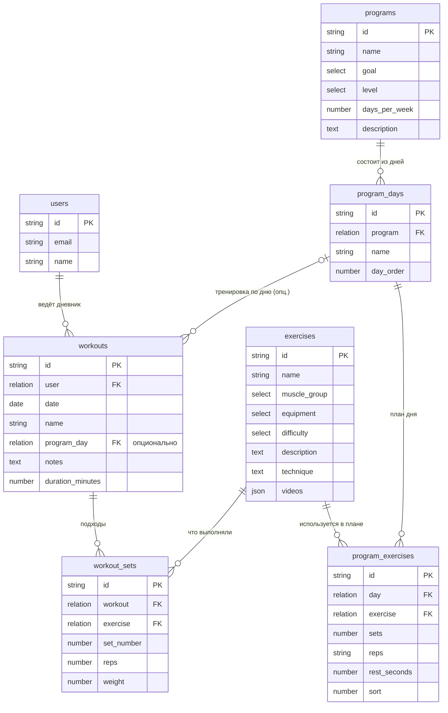

# Схема базы данных GymMate

PocketBase (SQLite). Схема создаётся миграциями из `pb_migrations/`, применяются командой
`./pocketbase migrate up` (после применения работающий сервер нужно перезапустить —
он кэширует схему коллекций).

## ER-диаграмма

## Коллекции

### `users` (auth, встроенная)

Стандартная auth-коллекция PocketBase: email + пароль, поле `name`.
Регистрация открыта, токен выдаётся через `auth-with-password`.

### `exercises` — справочник упражнений

Публичное чтение (`listRule`/`viewRule` пустые), запись только из админки/миграций.

| Поле           | Тип    | Описание                                                                                   |
| -------------- | ------ | ------------------------------------------------------------------------------------------ |
| `name`         | text   | Название упражнения (используется как ключ при импорте/апдейтах)                            |
| `muscle_group` | select | `chest`, `back`, `legs`, `glutes`, `calves`, `shoulders`, `biceps`, `triceps`, `forearms`, `abs`, `neck` |
| `equipment`    | select | `barbell`, `dumbbell`, `machine`, `cable`, `bodyweight`, `kettlebell`, `band`               |
| `difficulty`   | select | `beginner`, `intermediate`, `advanced`                                                      |
| `description`  | text   | Что это и зачем (свои тексты; у импортированных пока пусто)                                 |
| `technique`    | text   | Техника выполнения                                                                          |
| `videos`       | json   | Массив URL: YouTube-ролики и/или mp4 (сейчас — ссылки с tvoytrener.com, временные)          |

Индекс: `muscle_group`. Каталог импортирован миграцией `1749500004_import_tvoytrener.js`
(299 записей: название, группа, инвентарь, видео).

### `programs` — готовые программы тренировок

Публичное чтение.

| Поле            | Тип    | Описание                                            |
| --------------- | ------ | --------------------------------------------------- |
| `name`          | text   | Название программы                                  |
| `goal`          | select | `mass`, `weight_loss`, `relief`, `strength`         |
| `level`         | select | `beginner`, `intermediate`, `advanced`              |
| `days_per_week` | number | Тренировок в неделю (1–7)                           |
| `description`   | text   | Описание методики                                   |

### `program_days` — дни программы

Публичное чтение. Удаляются каскадом вместе с программой.

| Поле        | Тип      | Описание                          |
| ----------- | -------- | --------------------------------- |
| `program`   | relation | → `programs` (cascade delete)     |
| `name`      | text     | «День 1 — грудь и трицепс» и т.п. |
| `day_order` | number   | Порядок дня в программе (с 1)     |

### `program_exercises` — план дня

Публичное чтение. Связка «день ↔ упражнение» с дозировкой.

| Поле           | Тип      | Описание                                      |
| -------------- | -------- | --------------------------------------------- |
| `day`          | relation | → `program_days` (cascade delete)             |
| `exercise`     | relation | → `exercises` (cascade delete)                |
| `sets`         | number   | Количество подходов                           |
| `reps`         | text     | Повторы — строка: `8-10`, `5`, `30-60 сек`    |
| `rest_seconds` | number   | Отдых между подходами, сек                    |
| `sort`         | number   | Порядок упражнения внутри дня (с 1)           |

### `workouts` — тренировки (дневник)

Доступ только владельцу:

- list/view/update/delete: `user = @request.auth.id`
- create: `@request.auth.id != '' && user = @request.auth.id`

| Поле               | Тип      | Описание                                                          |
| ------------------ | -------- | ----------------------------------------------------------------- |
| `user`             | relation | → `users` (cascade delete)                                        |
| `date`             | date     | Дата тренировки                                                   |
| `name`             | text     | Название (по умолчанию имя дня программы или «Тренировка»)        |
| `program_day`      | relation | → `program_days`, опционально — если тренировка начата из программы |
| `notes`            | text     | Заметки по самочувствию/прогрессу                                 |
| `duration_minutes` | number   | Длительность, мин (пока не используется в UI)                     |

Индекс: `user`.

### `workout_sets` — подходы

Доступ только владельцу тренировки (правила через связь: `workout.user = @request.auth.id`).

| Поле         | Тип      | Описание                                        |
| ------------ | -------- | ----------------------------------------------- |
| `workout`    | relation | → `workouts` (cascade delete)                   |
| `exercise`   | relation | → `exercises` (cascade delete)                  |
| `set_number` | number   | Номер подхода в рамках упражнения (считает клиент) |
| `reps`       | number   | Повторы                                         |
| `weight`     | number   | Вес, кг (0/пусто — свой вес)                    |
| `created`    | autodate | Для сортировки подходов в порядке добавления    |

Индекс: `workout`.

## Миграции

| Файл                                   | Что делает                                                            |
| -------------------------------------- | --------------------------------------------------------------------- |
| `1749500000_init_collections.js`       | Все коллекции, правила доступа, индексы                               |
| `1749500001_seed_data.js`              | Стартовый сид: упражнения и 3 программы                               |
| `1749500002_workout_sets_created.js`   | Поле `created` у подходов                                             |
| `1749500003_exercise_videos_schema.js` | Группы `forearms`/`neck`, инвентарь `band`, json-поле `videos`        |
| `1749500004_import_tvoytrener.js`      | Импорт каталога (299 упражнений с видео)                              |
| `1749500005_drop_seed_exercises.js`    | Перепривязка программ/дневника на импортированные записи, чистка сида |
