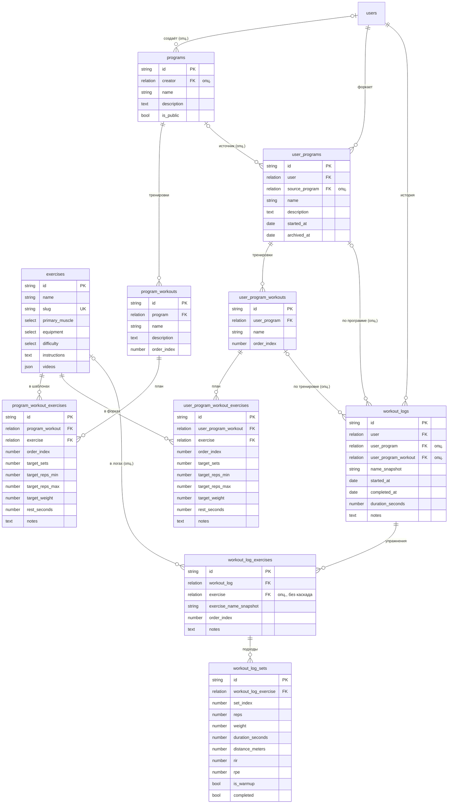

# Схема базы данных GymMate (v2)

PocketBase (SQLite). Схема создаётся миграциями из `pb_migrations/`, применяются командой
`./pocketbase migrate up` (после применения работающий сервер нужно перезапустить —
он кэширует схему коллекций).

Каноническое описание модели в виде PostgreSQL DDL — в [`schema.sql`](schema.sql)
(справочное, на случай переезда на Postgres).

Три слоя модели:

1. **Каталог** — `exercises`: глобальный справочник упражнений.
2. **Шаблоны** — `programs` → `program_workouts` → `program_workout_exercises`:
   программы тренировок, публичные или созданные пользователями.
3. **Пользовательский слой** — `user_programs` (+ workouts/exercises): независимый
   fork шаблона (правки не влияют на оригинал); `workout_logs` (+ exercises/sets):
   immutable-история выполнения со snapshot-полями, устойчивая к изменению
   каталога и программ задним числом.

Отличия от спеки Postgres (особенности PocketBase):

- PK — нативные 15-символьные id PocketBase, не UUID (UUID — в `schema.sql`).
- Relation-поля без суффикса `_id`: `program`, `exercise`, `user`, `workout_log` и т.д.
- `target_reps_min/max`, `target_weight`, `rest_seconds`, `reps` и т.п. — необязательные
  number-поля, где `0` означает «не задано» (в PocketBase у необязательных number-полей
  нет различия «0 / не задано»).
- `created_at`/`updated_at` → autodate-поля `created`/`updated`.

## ER-диаграмма

## Коллекции

### `users` (auth, встроенная)

Стандартная auth-коллекция PocketBase: email + пароль, поле `name`.
Регистрация открыта, токен выдаётся через `auth-with-password`.

| Поле       | Тип    | Описание                                                      |
| ---------- | ------ | ------------------------------------------------------------- |
| `name`     | text   | Имя пользователя                                              |
| `gender`   | select | `male` / `female` — модель фигуры на карте мышц (опционально) |
| `weight`   | number | Вес, кг (20–300, опционально)                                 |
| `height`   | number | Рост, см (100–250, опционально)                               |
| `birthdate`| date   | Дата рождения (опционально)                                   |

### `exercises` — глобальный каталог упражнений

Публичное чтение, запись только из админки/миграций.

| Поле             | Тип    | Описание                                                                                                 |
| ---------------- | ------ | -------------------------------------------------------------------------------------------------------- |
| `name`           | text   | Название упражнения                                                                                       |
| `slug`           | text   | Уникальный латинский слаг (транслит названия), unique-индекс                                              |
| `primary_muscle` | select | `chest`, `back`, `legs`, `glutes`, `calves`, `shoulders`, `biceps`, `triceps`, `forearms`, `abs`, `neck` |
| `equipment`      | select | `barbell`, `dumbbell`, `machine`, `cable`, `bodyweight`, `kettlebell`, `band`                             |
| `difficulty`     | select | `beginner`, `intermediate`, `advanced`                                                                    |
| `instructions`   | text   | Техника выполнения (бывшие `technique` + `description`)                                                   |
| `videos`         | json   | Массив URL: YouTube и/или mp4 (tvoytrener.com, media.musclewiki.com — front/side)                         |

Индексы: `primary_muscle`, unique `slug`. Каталог: 299 записей.

### `programs` — шаблоны программ

Шаблоны: системные (`creator` пуст) или пользовательские. Чтение: `is_public = true || creator = @request.auth.id`;
создание/правка/удаление — только своих (`creator = @request.auth.id`).

| Поле          | Тип      | Описание                                      |
| ------------- | -------- | --------------------------------------------- |
| `creator`     | relation | → `users`, опционально (пусто = системная)     |
| `name`        | text     | Название программы                            |
| `description` | text     | Описание методики                             |
| `goal`        | select   | `mass`, `weight_loss`, `relief`, `strength` — бейдж цели (опционально) |
| `difficulty`  | number   | Сложность 1..5, целое (опционально; в UI — полоска с градиентом) |
| `is_public`   | bool     | Видна всем                                    |

### `program_workouts` — тренировки шаблона

Правила доступа наследуются через `program.*`. Каскадное удаление с программой.

| Поле          | Тип      | Описание                              |
| ------------- | -------- | ------------------------------------- |
| `program`     | relation | → `programs` (cascade delete)         |
| `name`        | text     | «День 1 — грудь и трицепс» и т.п.     |
| `description` | text     | Описание тренировки                   |
| `order_index` | number   | Порядок тренировки в программе        |

### `program_workout_exercises` — план тренировки шаблона

| Поле              | Тип      | Описание                                  |
| ----------------- | -------- | ----------------------------------------- |
| `program_workout` | relation | → `program_workouts` (cascade delete)     |
| `exercise`        | relation | → `exercises`                             |
| `order_index`     | number   | Порядок упражнения                        |
| `target_sets`     | number   | Целевое число подходов                    |
| `target_reps_min` | number   | Повторы от (0 = не задано)                |
| `target_reps_max` | number   | Повторы до (0 = не задано)                |
| `target_weight`   | number   | Целевой вес, кг (0 = не задано)           |
| `rest_seconds`    | number   | Отдых между подходами, сек                |
| `notes`           | text     | Заметки (в т.ч. нечисловые повторы)       |

Индексы: `program_workout`, `exercise`.

### `user_programs` — программа пользователя (fork)

Независимая копия шаблона: при форке структура копируется в `user_program_*`,
дальнейшие правки не влияют на оригинал. Доступ — только владельцу.

| Поле             | Тип      | Описание                                  |
| ---------------- | -------- | ----------------------------------------- |
| `user`           | relation | → `users` (cascade delete)                |
| `source_program` | relation | → `programs`, опционально (откуда форк)   |
| `name`           | text     | Название                                  |
| `description`    | text     | Описание                                  |
| `difficulty`     | number   | Сложность 1..5 — snapshot из источника на момент форка (опционально) |
| `started_at`     | date     | Когда начал заниматься, опционально       |
| `archived_at`    | date     | Когда убрал в архив, опционально          |

Индекс: `user`.

### `user_program_workouts` — тренировки программы пользователя

Доступ через `user_program.user = @request.auth.id`.

| Поле           | Тип      | Описание                            |
| -------------- | -------- | ----------------------------------- |
| `user_program` | relation | → `user_programs` (cascade delete)  |
| `name`         | text     | Название тренировки                 |
| `order_index`  | number   | Порядок                             |

### `user_program_workout_exercises` — план тренировки пользователя

Поля идентичны `program_workout_exercises`, FK — `user_program_workout`
(cascade delete). Доступ через `user_program_workout.user_program.user`.

### `workout_logs` — история выполнения

Фактически выполненные тренировки. Доступ — только владельцу; `update` оставлен,
чтобы завершать тренировку (`completed_at`), но история по смыслу immutable:
snapshot-поля (`name_snapshot`) делают её независимой от изменения программ.

| Поле                   | Тип      | Описание                                          |
| ---------------------- | -------- | ------------------------------------------------- |
| `user`                 | relation | → `users` (cascade delete)                        |
| `user_program`         | relation | → `user_programs`, опционально                    |
| `user_program_workout` | relation | → `user_program_workouts`, опционально            |
| `name_snapshot`        | text     | Название тренировки на момент выполнения          |
| `started_at`           | date     | Начало                                            |
| `completed_at`         | date     | Завершение, опционально (пусто = идёт сейчас)     |
| `duration_seconds`     | number   | Длительность, сек                                 |
| `notes`                | text     | Заметки                                           |

Индексы: `user`, `user_program`.

### `workout_log_exercises` — упражнения в логе

`exercise` без каскадного удаления: если упражнение удалят из каталога,
история сохранится благодаря `exercise_name_snapshot`.

| Поле                     | Тип      | Описание                                  |
| ------------------------ | -------- | ----------------------------------------- |
| `workout_log`            | relation | → `workout_logs` (cascade delete)         |
| `exercise`               | relation | → `exercises`, опционально, без каскада   |
| `exercise_name_snapshot` | text     | Название упражнения на момент выполнения  |
| `order_index`            | number   | Порядок в тренировке                      |
| `notes`                  | text     | Заметки                                   |

Индекс: `workout_log`.

### `workout_log_sets` — подходы

Доступ через `workout_log_exercise.workout_log.user = @request.auth.id`.

| Поле                   | Тип      | Описание                                   |
| ---------------------- | -------- | ------------------------------------------ |
| `workout_log_exercise` | relation | → `workout_log_exercises` (cascade delete) |
| `set_index`            | number   | Номер подхода (с 1)                        |
| `reps`                 | number   | Повторы                                    |
| `weight`               | number   | Вес, кг (0/пусто — свой вес)               |
| `duration_seconds`     | number   | Для упражнений на время                    |
| `distance_meters`      | number   | Для кардио                                 |
| `rir`                  | number   | Reps in reserve, 0–10                      |
| `rpe`                  | number   | RPE, 0–10                                  |
| `is_warmup`            | bool     | Разминочный подход                         |
| `completed`            | bool     | Подход выполнен                            |
| `created`              | autodate | Порядок добавления                         |

Индекс: `workout_log_exercise`.

## Миграции

| Файл                                   | Что делает                                                              |
| -------------------------------------- | ----------------------------------------------------------------------- |
| `1749500000_init_collections.js`       | Схема v1: коллекции, правила доступа, индексы                           |
| `1749500001_seed_data.js`              | Стартовый сид: упражнения и 3 программы                                 |
| `1749500002_workout_sets_created.js`   | Поле `created` у подходов                                               |
| `1749500003_exercise_videos_schema.js` | Группы `forearms`/`neck`, инвентарь `band`, json-поле `videos`          |
| `1749500004_import_tvoytrener.js`      | Импорт каталога (299 упражнений с видео)                                |
| `1749500005_drop_seed_exercises.js`    | Перепривязка программ/дневника на импортированные записи, чистка сида   |
| `1749500006_musclewiki_videos.js`      | Видео с musclewiki.com (mp4, front/side) для 224 упражнений             |
| `1749500006_users_gender.js`           | Поле `gender` у пользователя                                            |
| `1749500007_v2_schema.js`              | Схема v2: шаблоны/форки/логи, перенос данных, удаление старых коллекций |
| `1749500008_programs_goal.js`          | Возврат поля `goal` у программ (восстановлено из мета-строки description) |
| `1781180254_updated_users.js`        | Включён OAuth2 для пользователей                                          |
| `1781190000_user_profile_fields.js`  | Поля профиля: `weight`, `height`, `birthdate`                             |
| `1781200000_drop_day_of_week.js`     | Удалено легаси-поле `day_of_week` у `program_workouts` и `user_program_workouts` |
| `1781210000_programs_difficulty.js`  | Поле `difficulty` (1..5) у программ + оценки посевных                      |
| `1781290000_user_programs_difficulty.js` | Поле `difficulty` у форков + бэкфилл из программы-источника            |
